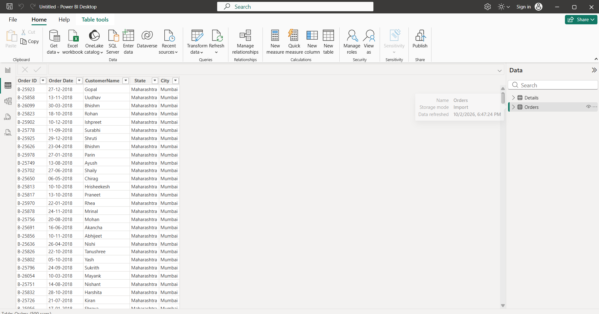

# Sales & Profit Performance Dashboard | Power BI

An interactive Sales & Profit Performance Dashboard built using Microsoft Power BI to analyze sales, profit, quantity, orders, customers, products, and geographical performance.

## Project Roadmap

The project is being developed step-by-step using the following workflow:

1. Import Data
2. Power Query Cleaning
3. Data Type Validation
4. Data Modeling & Relationships
5. DAX Measures
6. Dashboard Development
7. Interactivity
8. Business Insights
9. Final `.pbix` Project
10. GitHub Documentation
11. Resume Integration

---

# Step 1 — Import Data

## Objective

The first step is to import the two sales datasets into Power BI and prepare them for further transformation and analysis.

### Datasets Used

The project contains two related tables:

### Orders Table

Contains order-level information:

- Order ID
- Order Date
- Customer Name
- State
- City

### Details Table

Contains transaction-level information:

- Order ID
- Amount
- Profit
- Quantity
- Category
- Sub-Category
- Payment Mode

The two tables share a common field:

`Order ID`

This field will later be used to establish a relationship between the two tables.

---

## Step 1.1 — Import Orders.csv

### Process

1. Open Power BI Desktop.
2. Go to **Home → Get Data**.
3. Select **Text/CSV**.
4. Select `Orders.csv`.
5. In the preview window, select **Transform Data** instead of directly loading the data.

### Why Transform Data?

The raw dataset should not be directly used for analysis.

The general Power BI workflow is:

Raw Data  
↓  
Power Query  
↓  
Clean & Transform Data  
↓  
Data Model  
↓  
Analysis & Visualization

Power Query is used as the data preparation and transformation layer before the data enters the Power BI model.

---

## Step 1.2 — Import Details.csv

After opening Power Query Editor:

1. Go to **Home → New Source**.
2. Select **Text/CSV**.
3. Select `Details.csv`.

## Screenshot



The Power Query Editor should now contain two queries:

```text
Queries
├── Orders
└── Details
